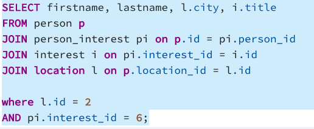
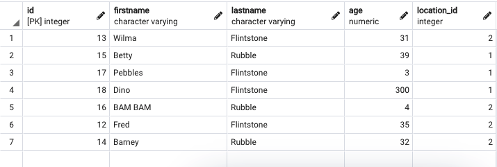
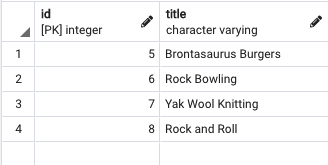
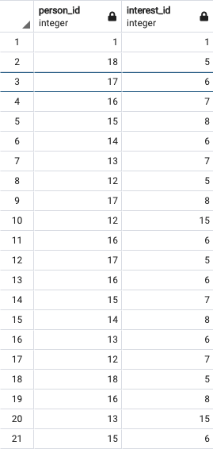
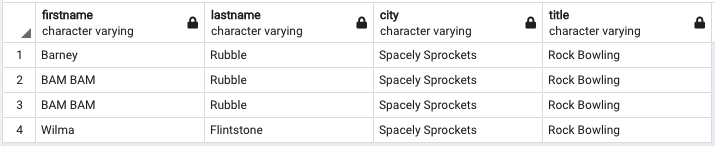

# Schema Design

# JOIN table
SELECT firstname, lastname, l.city, i.title
FROM person p
JOIN person_interest pi on p.id = pi.person_id
JOIN interest i on pi.interest_id = i.id
JOIN location l on p.location_id = l.id

where l.id = 2
AND pi.interest_id = 6;

# Person table

# Location Table

# Interest Table

# Person_Interest JOIN Table

# Output Table

---
Create a database schema that will represent People, their Location, and their Interests. This database is intended to be used to connect individuals who are in the same location and share interests.

## Steps
---
1. Create the three required tables (Person, Location, & Interest) along with any required join tables. Include the following listed columns in the designated tables, along with any additional columns required for join statements.
  * Person
    - Id (Primary Key)
    - First Name
    - Last Name
    - Age
  * Location
    - Id (Primary Key)
    - City
    - State
    - Country
  * Interest
    - Id (Primary Key)
    - Title
    
2. Set all Id fields to be autogenerated primary keys.
3. Add join columns and tables as necessary to ensure that:
  - A Person can have any number of interests
  - A Person must have one location
4. Write a SQL query that will find all Person entries that share a specified Interest and have the same specified Location (The Interest & Location can be hard coded during testing, this will be parameterized later).
